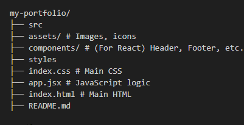

# Personal Portfolio

A responsive and modern portfolio website built using **HTML5**, **CSS3**, **JavaScript**, **React.js** & **Bootstrap**, to showcase my projects, skills, and resume.

## 📌 Features

- ✅ Responsive design for mobile, tablet, and desktop
- ✅ Project showcase cards to add in future with links to live demos and source code
- ✅ About Me section with skills and education
- ✅ Downloadable resume
- ✅ Contact form (FormSubmit)
- ✅ Scroll to top button with smooth scrolling

## 🛠️ Technologies Used

- ✅ Core Frontend: HTML5, CSS & JavaScript
- ✅ Framework: React JS & Bootstrap5
- ✅ Tools: Git
- ✅ Deployment: GitHub & Vercel
- ✅ Others: react-icons & Animate.css

## 📂 Folder Structure

## 📡 Live Demo

Portfolio Live Link: https://prathamesh-mhetre.vercel.app/

## 📬 Contact

- ✅ Email: prathameshmhetre25@gmail.com
- ✅ LinkedIn: linkedin.com/in/prathameshmhetre
- ✅ GitHub:https://github.com/prathamesh2503
